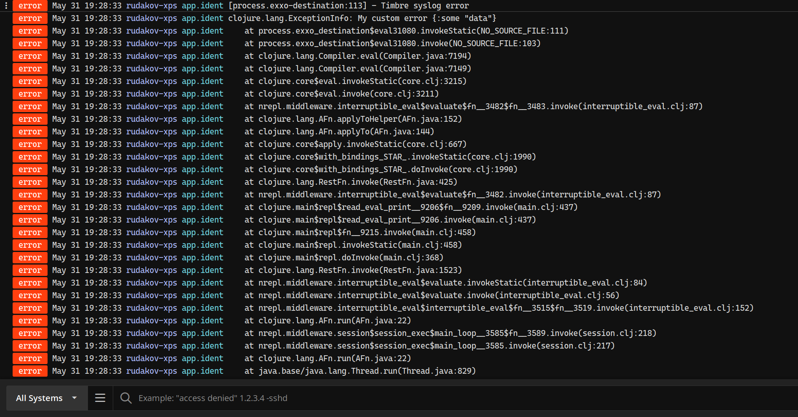

- [Status](#orgebb78ca)
- [Usage](#orgfa1798b)
  - [`deps.edn`](#org10dd177)
  - [Leiningen](#orgc9348c7)
  - [Register appender](#orgfca3dca)
- [Configuration](#org296817f)
  - [stacktraces](#org90b16a1)

[](https://clojars.org/net.clojars.rrudakov/timbre-syslog-remote) [https://cljdoc.org/badge/net.clojars.rrudakov/timbre-syslog-remote](https://cljdoc.org/d/net.clojars.rrudakov/timbre-syslog-remote)

Third-party timbre syslog appender with remote host support.

The main purpose of this library is to provide a direct integration of timbre and [Papertrail](https://papertrailapp.com).

The format of messages is compliant with [RFC 3164](https://www.rfc-editor.org/rfc/rfc3164).


<a id="orgebb78ca"></a>

# Status

The library is tested with papertrail and I don't expect any breaking changes. It's not tested with localhost, but it should work if syslog is configured properly (it should listen to the port 514).


<a id="orgfa1798b"></a>

# Usage


<a id="org10dd177"></a>

## `deps.edn`

```clojure
net.clojars.rrudakov/timbre-syslog-remote {:mvn/version "0.2.8"}
```


<a id="orgc9348c7"></a>

## Leiningen

```clojure
[net.clojars.rrudakov/timbre-syslog-remote "0.2.8"]
```


<a id="orgfca3dca"></a>

## Register appender

```clojure
(require '[io.rrudakov.timbre.syslog :refer [syslog-appender]])

(binding [timbre/*config*
          (assoc-in timbre/*config* [:appenders :syslog]
                    (syslog-appender {:host           "logs2.papertrailapp.com"
                                      :port           99999
                                      :no-stacktrace? true
                                      :ident          "application.name"}))]

  (timbre/infof "This is my info %d" (rand-int 999)))
```


<a id="org296817f"></a>

# Configuration

All configuration parameters are optional.

-   **`:host`:** remote host to connect (default: `localhost`)
-   **`:port`:** UDP port (default: `514`)
-   **`:ident`:** application name (default: `nil`)
-   **`:no-stacktrace?`:** if `false` stacktraces will be logged (default: `false`)


<a id="org90b16a1"></a>

## stacktraces

Syslog doesn't support multiline log messages by default, but sometimes it's useful to print exceptions with stacktraces. If option `:no-stacktrace?` is `false`, stacktrace will be sent line by line:

